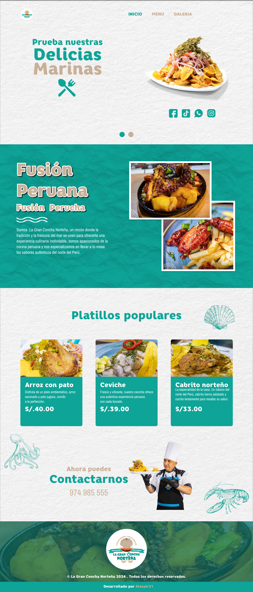

# Restaurante React

Este es un proyecto web de un restaurante llamado **La Gran Concha Norteña**, desarrollado con **React** y **Vite**. Está diseñado para mostrar las delicias culinarias y la carta del restaurante, con un diseño atractivo y moderno utilizando **TailwindCSS** y **Material Tailwind**.

## Funcionalidades

- Página de inicio con presentación del restaurante y platos principales.
- Visualización de la carta de menú con categorías como entradas, ceviches, criollos norteños, y leches de tigre.
- Galería de imágenes destacando la experiencia gastronómica del restaurante.

## Capturas de pantalla

### Página de inicio:


### Nuestra Carta:


### Galería:


## Tecnologías usadas

- **React**: Biblioteca principal para la creación de componentes.
- **TailwindCSS**: Framework para la creación de estilos con clases utilitarias.
- **Material Tailwind**: Componentes preconstruidos para un diseño moderno.
- **React Router DOM**: Navegación entre las diferentes vistas.
- **Animate.css**: Animaciones CSS para mejorar la experiencia del usuario.
- **Vite**: Herramienta de construcción rápida para aplicaciones modernas de front-end.

## Instalación y configuración

Para instalar y configurar este proyecto localmente, sigue estos pasos:

1. Pasos para ver el proyecto
   ```bash
   git clone https://github.com/usuario/restaurante-react.git
   npm install
   npm run dev
   npm run build
   npm run preview